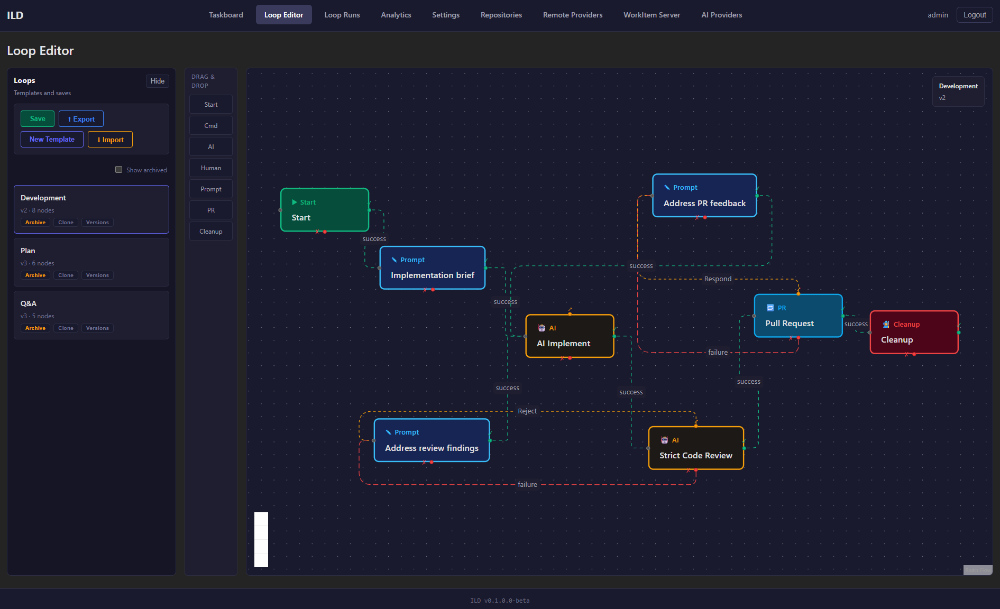
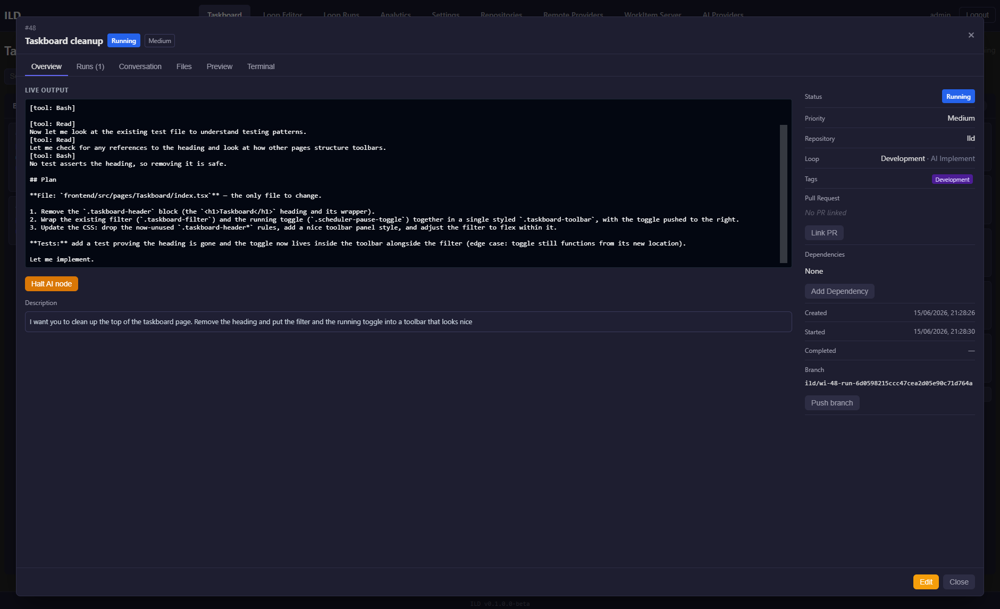
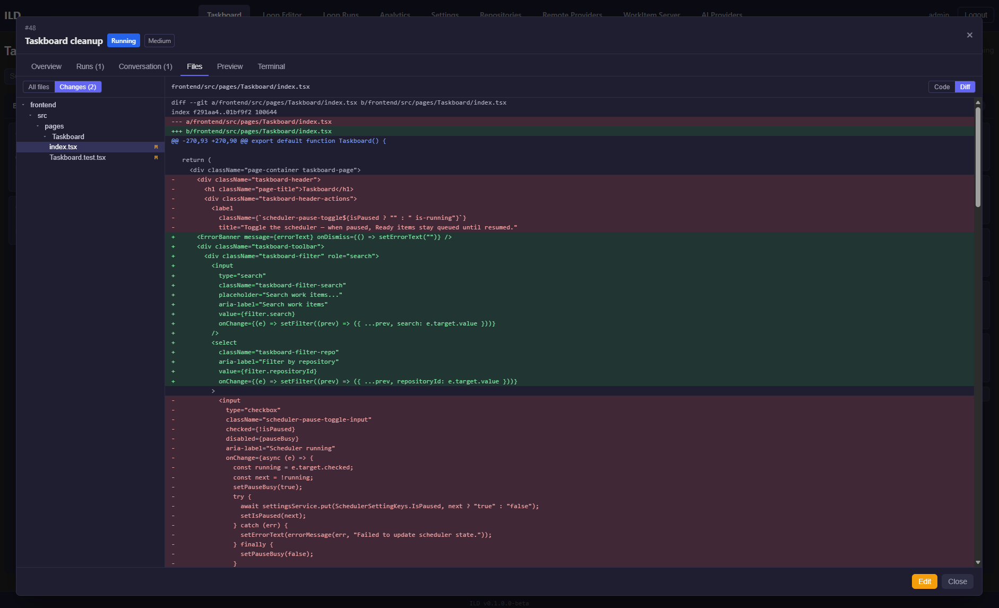
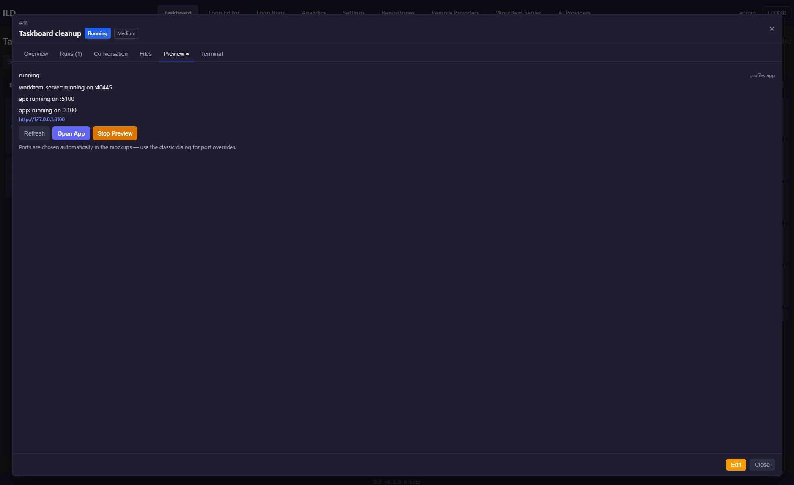

# ILD — In-Loop Development

> ⚠️ **Heads up:** ILD is a vibecoded app, built to make experimenting with different AI workflows easy. There are no guarantees that it works, and things may break without warning. Use it at your own risk.

ILD is a containerized development orchestration system built around shared work items, loop templates, per-run git worktrees, and adapter-driven AI execution. A local ILD instance owns loop execution, repository operations, previews, and the realtime UI; a standalone WorkItem Server owns the work-item source of truth so multiple ILD instances can coordinate safely.

Work flows through a taskboard and resolves via versioned, visual loop templates made of `Start`, `Cmd`, `AI`, `Human`, `Prompt`, `PR`, and `Cleanup` nodes. AI nodes are adapter-based and run external agent CLIs — currently `opencode`, `pi`, and `claude-code` — inside the worktree.

## What ILD does

- Shared work-item coordination through a standalone WorkItem Server with atomic `Running` claims, heartbeats, stale reclaim, dependencies, tags, and conversation history.
- A taskboard UI covering `Backlog`, `WorkQueue`, `Ready`, `Running`, `HumanFeedback`, `WaitingForIld`, and `Done`.
- Visual, versioned loop-template editing and execution with retries, `OnFailure` routing, pause/resume, crash recovery, and startup reconciliation.
- Manual starts from the UI and automatic claiming via background polling.
- Adapter-driven AI execution across the `opencode`, `pi`, and `claude-code` provider types.
- QA preview orchestration for active worktrees, and realtime updates over SignalR for run events, work-item changes, and node progress.

## Quickstart

The supported deployment path is the checked-in Docker Compose stack:

```bash
git clone <this repo> ild && cd ild
cp .env.example .env
# set ILD_PASSWORD before continuing
docker compose up --build
```

This starts `postgres` (5432), `workitem-server` (8081), and `ild` (8080). Open <http://localhost:8080> and log in with `admin` (or your `ILD_USERNAME`) and the `ILD_PASSWORD` you supplied.

See [docs/deployment.md](docs/deployment.md) for volumes, bind mounts, and first-startup behavior, and [docs/development.md](docs/development.md) to run from source.

## Screenshots

**Loop Editor** — build loop templates visually by wiring together `Start`, `Prompt`, `AI`, `PR`, `Cleanup`, and other node types. Edges carry success, failure, and custom routing so you can model retries, human gates, and multi-stage review flows without touching config files.



**Live output** — the Overview tab on a running work item streams the AI agent's tool calls and reasoning in real time alongside run metadata: status, priority, repository, loop assignment, branch, and dependencies.



**Files diff** — the Files tab shows the exact git diff produced by the AI agent inside its isolated worktree, so you can review every addition and deletion before the branch is pushed or a PR is opened.



**QA preview** — the Preview tab boots the project's full stack (API, app, WorkItem Server) inside the run's worktree and gives you a direct link to open and test the AI's changes live before they are merged. Configured via [`ild.config.json`](docs/configuration.md#ildconfigjson) in the repository root.



## Documentation

| Doc                                        | Contents                                                    |
| ------------------------------------------ | ----------------------------------------------------------- |
| [Architecture](docs/architecture.md)       | Service split, module boundaries, realtime channel          |
| [Domain model](docs/domain-model.md)       | Core concepts, node types, and the AI execution model       |
| [Configuration](docs/configuration.md)     | Environment variables and build-time container options      |
| [API surface](docs/api.md)                 | ILD and WorkItem Server endpoints, SignalR hubs, versioning |
| [Deployment](docs/deployment.md)           | Compose stack, volumes, images, first-startup behavior      |
| [Development](docs/development.md)         | Running from source, validation, migrations, QA preview     |
| [Troubleshooting](docs/troubleshooting.md) | Common operational issues                                   |
| [CONTEXT.md](CONTEXT.md)                   | Deep engineering reference and domain glossary              |
| [PRD.md](docs/PRD.md)                      | Product requirements and scope                              |

## License

See [LICENSE](LICENSE).
