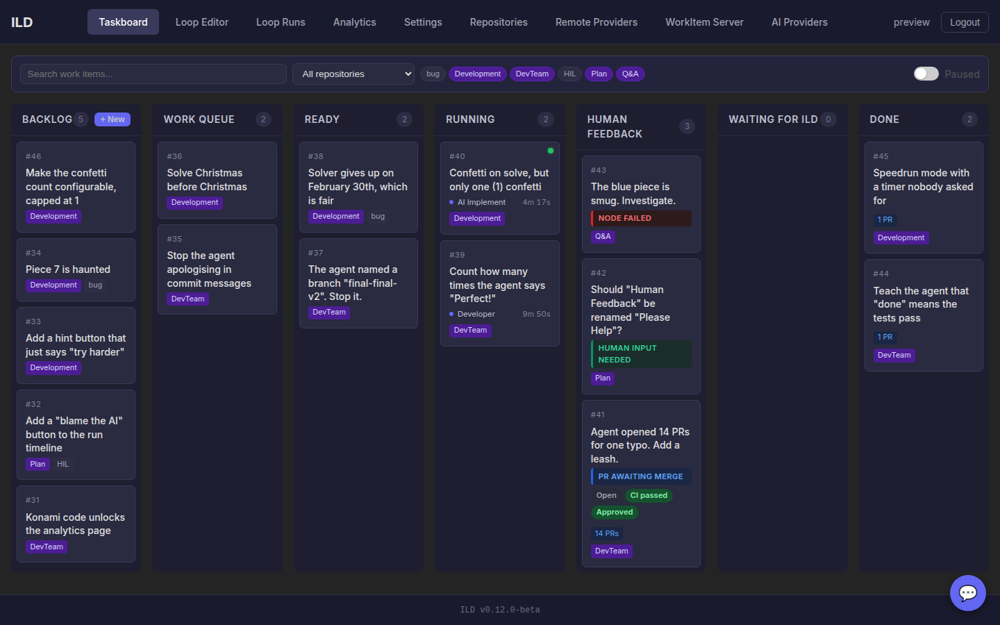
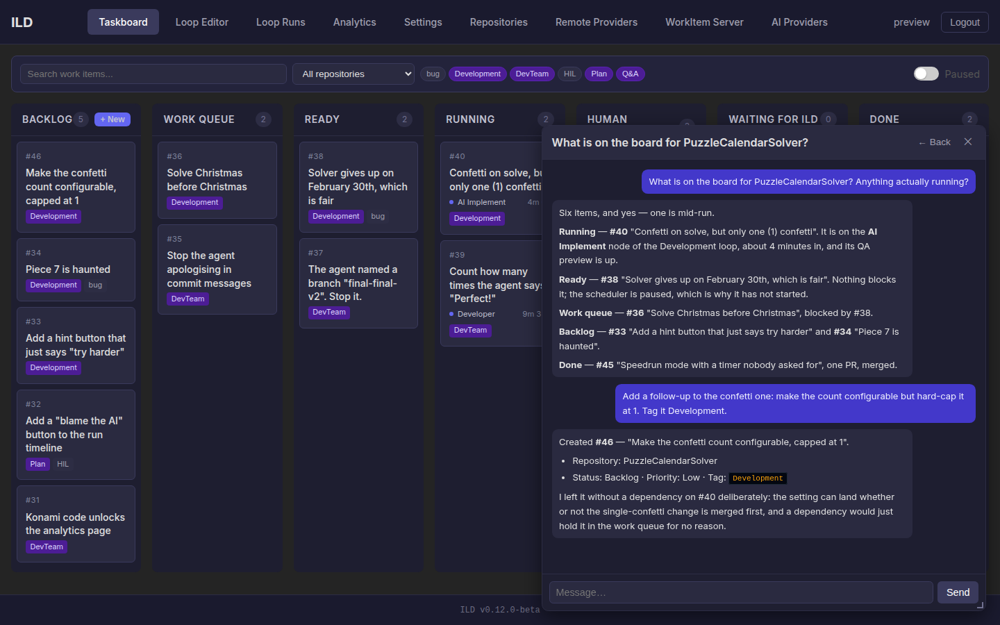
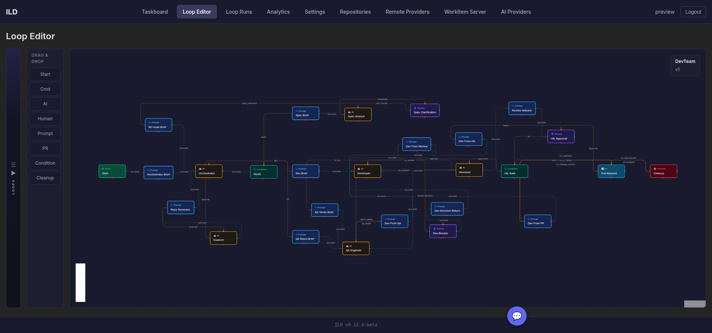
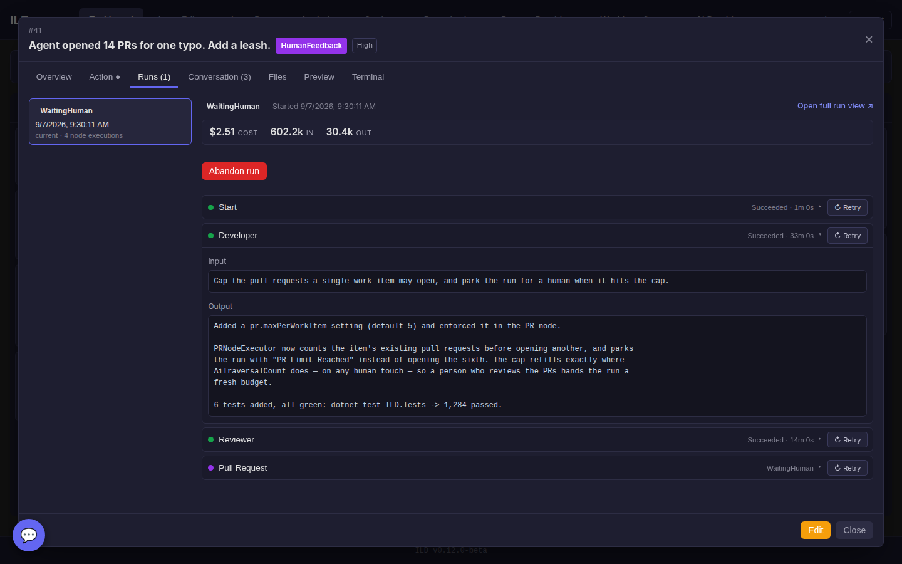
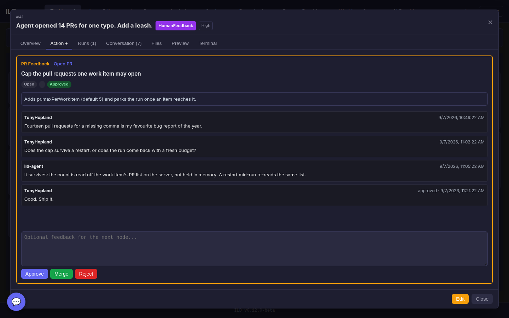
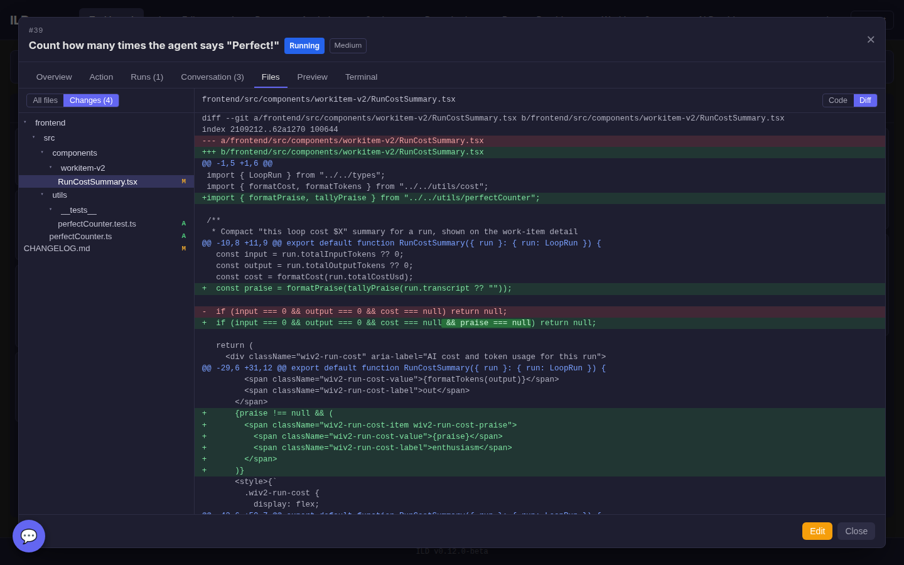
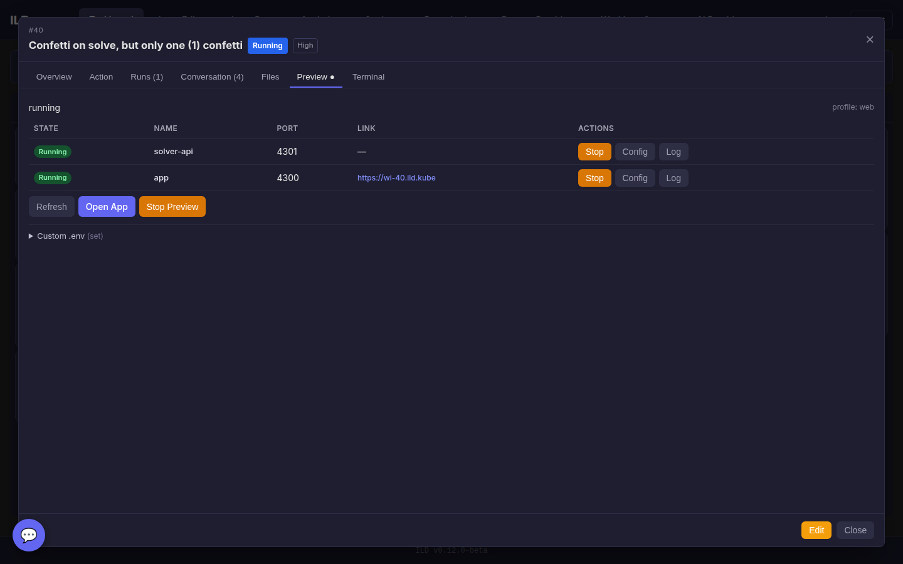
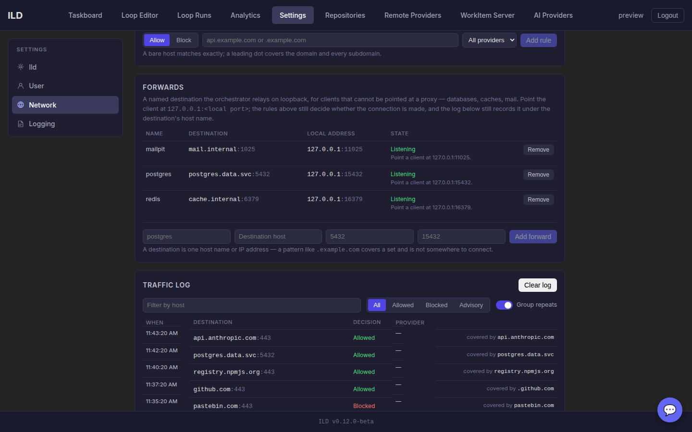
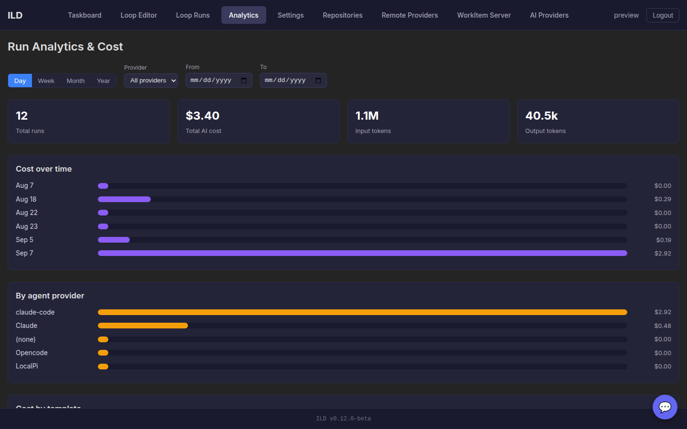

# ILD — In-Loop Development

> ⚠️ **Heads up:** ILD is a vibecoded app, built to make experimenting with different AI workflows easy. There are no guarantees that it works, and things may break without warning. Use it at your own risk.

ILD is a containerized development orchestration system built around shared work items, loop templates, per-run git worktrees, and adapter-driven AI execution. A local ILD instance owns loop execution, repository operations, previews, and the realtime UI; a standalone WorkItem Server owns the work-item source of truth so multiple ILD instances can coordinate safely.

Work flows through a taskboard and resolves via versioned, visual loop templates made of `Start`, `Cmd`, `AI`, `Human`, `Prompt`, `PR`, and `Cleanup` nodes. AI nodes are adapter-based and run external agent CLIs — currently `opencode`, `pi`, `claude-code`, and `copilot` — inside the worktree.

## What ILD does

- Shared work-item coordination through a standalone WorkItem Server with atomic `Running` claims, heartbeats, stale reclaim, dependencies, tags, and conversation history.
- A taskboard UI covering `Backlog`, `WorkQueue`, `Ready`, `Running`, `HumanFeedback`, `WaitingForIld`, and `Done`.
- Visual, versioned loop-template editing and execution with retries, `OnFailure` routing, pause/resume, crash recovery, and startup reconciliation.
- Manual starts from the UI and automatic claiming via background polling.
- Adapter-driven AI execution across the `opencode`, `pi`, `claude-code`, and `copilot` provider types.
- QA preview orchestration for active worktrees, and realtime updates over SignalR for run events, work-item changes, and node progress.

## Quickstart

The supported deployment path is the checked-in Docker Compose stack:

```bash
git clone <this repo> ild && cd ild
cp .env.example .env
# fill in the required secrets before continuing
docker compose up --build
```

Compose refuses to start until `.env` supplies the five secrets it treats as required: `WORKITEM_API_KEYS`, `ILD_SESSION_TOKEN_PEPPER`, and the three database passwords. Generate each with `openssl rand -hex 32`. Set `ILD_PASSWORD` as well — compose does not enforce that one, but without it the first login has no account to create.

This starts `postgres` (compose network only), `workitem-server` (8081), and `ild` (8080). Open <http://localhost:8080> and log in with `admin` (or your `ILD_USERNAME`) and the `ILD_PASSWORD` you supplied.

See [docs/deployment.md](docs/deployment.md) for volumes, bind mounts, and first-startup behavior, and [docs/development.md](docs/development.md) to run from source.

## Screenshots

**Taskboard** — every work item across the seven statuses, in one view. A running card carries the node it is on and how long it has been there; a parked one says why it stopped, down to the PR's CI and review verdicts. Tags that name a loop template are highlighted, because that is what decides which loop the item runs.



**AI chat** — a chat bubble on every page, wired to the same work-item tools the loops use. Ask it what is on the board and it reads the real one; tell it to file something and the card is there when you close the panel.



**Loop Editor** — build loop templates visually by wiring together `Start`, `Prompt`, `AI`, `PR`, `Condition`, `Human`, and `Cleanup` nodes. This is the `DevTeam` loop: an orchestrator that routes to a spec analyst, an explorer, a developer, a QA engineer and a reviewer, with named edges — `qa_failed`, `on_merge_conflict`, `ask_human` — carrying the work back to whichever role should handle it.



**Run timeline** — the Runs tab replays a run node by node: what each one was given, what it produced, how long it took, and what the AI nodes cost in tokens and dollars. Any node can be retried on its own without restarting the loop.



**Human gates** — when a loop reaches a `Human` or `PR` node it parks and waits. The Action tab shows why it stopped, the pull request's state and review thread, and the buttons that send it back down a success, failure, or custom edge.



**Files diff** — the Files tab shows the exact git diff produced by the AI agent inside its isolated worktree, so you can review every addition and deletion before the branch is pushed or a PR is opened.



**QA preview** — the Preview tab boots the project's own services inside the run's worktree, on ports allocated for that run, and gives you a link to open and test the AI's changes live before they are merged. Which services, and how they start, comes from [`ild.config.json`](docs/configuration.md#ildconfigjson) in the repository root.



**Network** — agents reach the outside world through one proxy, and every attempt is on the record: an allow/block list, a live log of what was tried and what happened to it, and an **Allow** button on any blocked row. Forwards relay a named destination on loopback for the clients that cannot be pointed at a proxy — databases, caches, mail.



**Run analytics** — what the loops actually cost. Totals and per-day spend, broken down by agent provider and by loop template, so an expensive template is visible before the bill is.



## Documentation

| Doc                                        | Contents                                                    |
| ------------------------------------------ | ----------------------------------------------------------- |
| [Architecture](docs/architecture.md)       | Service split, module boundaries, realtime channel          |
| [Domain model](docs/domain-model.md)       | Core concepts, node types, and the AI execution model       |
| [Configuration](docs/configuration.md)     | Environment variables and build-time container options      |
| [API surface](docs/api.md)                 | ILD and WorkItem Server endpoints, SignalR hubs, versioning |
| [Deployment](docs/deployment.md)           | Compose stack, volumes, images, first-startup behavior      |
| [Development](docs/development.md)         | Running from source, validation, migrations, QA preview     |
| [Troubleshooting](docs/troubleshooting.md) | Common operational issues                                   |
| [CONTEXT.md](CONTEXT.md)                   | Deep engineering reference and domain glossary              |
| [PRD.md](docs/PRD.md)                      | Product requirements and scope                              |

## License

See [LICENSE](LICENSE).
